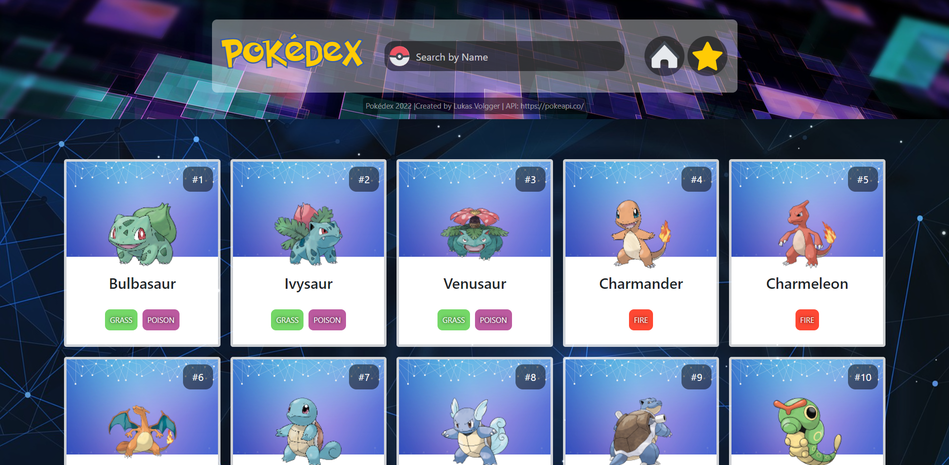
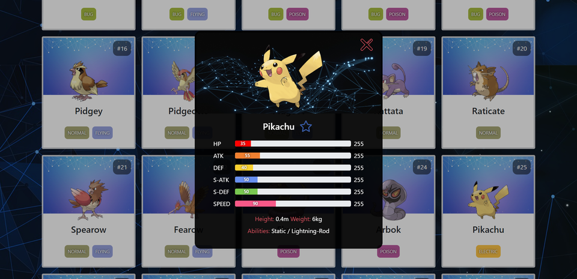
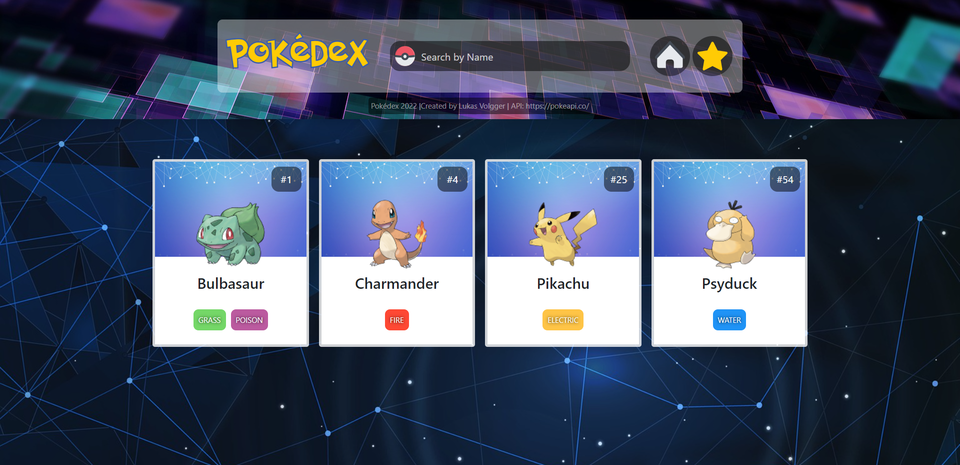

<h1>Pokédex</h1>

This is a learning project from the Frontend Web Development course of the <a href="https://developerakademie.com/">Developer Akademie</a>. The focus was on handling APIs and learning HTML, CSS and JS. The Bootstrap design framework was also used. 

<b>IMPORTANT:</b> Please note that learning projects focus on the given tasks. It is therefore possible that some functions do not work or are not scripted.
<h3>Table of Contents</h3>

- <a href="#features">Features</a>
- <a href="#preview">Preview</a>
- <a href="#installation">Installation</a>
- <a href="#license">License</a>

<h2 id="features">Features</h2>
Here is an overview of the most important functions of the project. Click on the summary to expand. 

 

<b>Available Languages</b>

  
:heavy_check_mark: English  
  

<b>Functionality</b>

  
:heavy_check_mark: All 1126 Pokémon are available  
:heavy_check_mark: Pagination: 20 Pokémon are loaded. Scrolling all the way down will load another 20 Pokémon  
:heavy_check_mark: Click on a Pokémon to see the details  
:heavy_check_mark: Search all Pokémon  
:heavy_check_mark: Save your favorite Pokémon  
:heavy_check_mark: Favorite Pokémon are saved in local storage  
:heavy_check_mark: Responsive Webdesign  
  

<h2 id="preview">Preview</h2>

---

---

<h2 id="installation">Installation</h2>
Follow these steps to install/test the project.

<h3 id="requirements">1. Requirements</h3>
All you need is a web browser like one of the following:
 
 

<h3>2. Download the Source</h3>
Download the source code or clone the repository on your local computer by clicking the <b>Code</b> button.
 
 

<h3>3. Start the Project</h3>
Navigate to the location on your computer where you downloaded/cloned the code. In the project directory, open the <b>index.html</b> file with a web browser.
 
 

 
index.html

<h2 id="license">License</h2>

